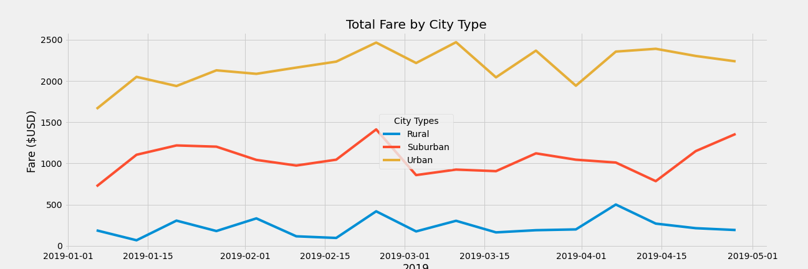

# PyBer_Analysis
## Purpose and Scope
The purpose of this project is to analyze the company "PyBer" driving data with its key metrics and across Urban, Suburban, and Rural cities. 

### Metrics Summary

- The key metrics for PyBer include totals of:
  -  Number of rides per city type,
  -  Number of drivers per city type,
  -  Overall Cost (or fare) by city type,
  -  Average for Cost per ride by city type,
  -  Average for Cost per driver by city type.
  

|          | Total Rides   | Total Drivers   | Total Fares   | Average Fare per Ride   | Average Fare per Driver   |
|:---------|:--------------|:----------------|:--------------|:------------------------|:--------------------------|
| Rural    | 125           | 78              | $4,327.93     | $34.62                  | $55.49                    |
| Suburban | 625           | 490             | $19,356.33    | $30.97                  | $39.50                    |
| Urban    | 1,625         | 2,405           | $39,854.38    | $24.53                  | $16.57                    |

-Urban Cities produce the greatest revenue for PyBer rides while simultaneously offering the lowest average fare costs per ride and per driver.

-Suburban Cities produce the next greatest revenue amount and average costs per ride and driver.

-Rural Cities produce the least revenue and present the highest average costs per ride and per driver.

#### Metric Visualization: Comparative Line Chart

  - When comparing time versus fare the overall trends remain evident: Urban > Suburban > Rural.
  - However, across all types there is a noticeable increase in fares collected for about a week in February and a decline towards the beginning of March.
  - The lowest revenue producing time period across all types appears to be at the start of January.

   ## Challenges
   Working with separate datasets was not practical in this case. In order to compare datasets effectively and across all categories and types, separate datasets were merged into one primary set. From that primary set various comparative sets were created. The flexibility to "cross examine" is significantly greater when relevant datasets are merged.

   ## Recommendations
   The disparities found between city types is important and should be considered in light of demand. It is highly probable the demand for rides will always be less than in a large urban city, since the amount of people is significantly less.

   However, it would be worthwhile to consider analysis of ride distance per city type and overall trip cost. This will help PyBer determine how to maximize their revenue in rural areas where frequency may be less but distance could be an important factor in why overall cost is greater.

   Finally, the collection of distance data would be required for the suggested further analysis. To accomplish the analysis, statistical summary data would be utilized similarly by producing total miles and average fare dependent on trip length. A comparison across city types would continue to be beneficial.